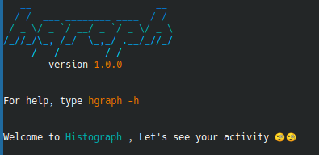

# **Histograph**

**Histograph** is a colorful, intuitive CLI tool that helps you track your local coding activity and Git repository statistics. Whether you're curious about your most active coding hours or need insights into repository-level stats, **Histograph** has you covered. 

## 🚀 Features

- ⏱ **Track Coding Hours**: Automatically logs your coding activity and provides daily stats.
- 📊 **Repository Stats**: Analyze Git repository statistics by email.
- 📧 **Commits Analysis**: Visualise your commit histories for specific email via a colorful graph.
- 📂 **Folder Scanning**: Add and track multiple repositories with a single command.
- 🌟 **Interactive Curve Graphs**: Visualize your coding activity with intuitive ASCII graphs.

---

## 🛠 Setup and Installation

### Prerequisites
- **Java 17** or later.
- **Maven** for dependency management.
- A love for coding stats! ❤️

### Installation Steps

1. **Clone the repository**:
   ```bash
   git clone https://github.com/TayssirGh/Histograph.git
   cd Histograph/hgraph/
2. **Build the project:**:
   ```bash
   mvn clean package
3. **Run the setup script:**:
   ```bash
    ./setup.sh
4. **Verify installation:**
   ```bash
    hgraph

If you see the Histograph ASCII logo, you're all set! 🎉

---

## 🛡 Monitoring Your Coding Activity
The `monitor.sh` script tracks your coding hours by detecting when your favorite IDE (default: idea) is running. It logs your activity in` ~/.monitor.log`

💡 To enable it as a background service:
```bash
    sudo ./setup_service.sh
  ```
Check its status:
``` bash
systemctl status process-monitor.service
```
---

## 🔬 Development and Testing
* Unit Tests: Built with JUnit and Mockito.
* Run tests with:
``` bash 
mvn test
```

* Build Native Image (optional, requires GraalVM):
```bash
mvn package -Pnative
 ```
### Thanks for Dropping By! 🙌


